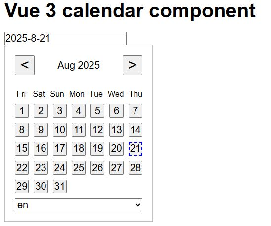

### Тестовое задание для компании "Рабочие Руки"

UI компонент календарь разработанный на Vue 3

<picture>
 
</picture>

Установка:

1. Склонируйте репозиторий: `git clone https://github.com/IvanZemsky/Vue-Calendar [директория]`
2. Выполните установку пакетов: `npm install `
3. Запустите проект: `npm run dev`